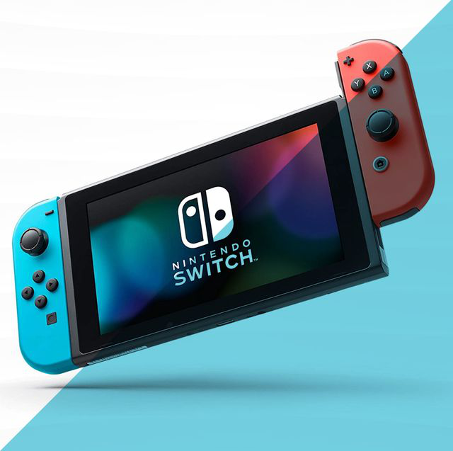
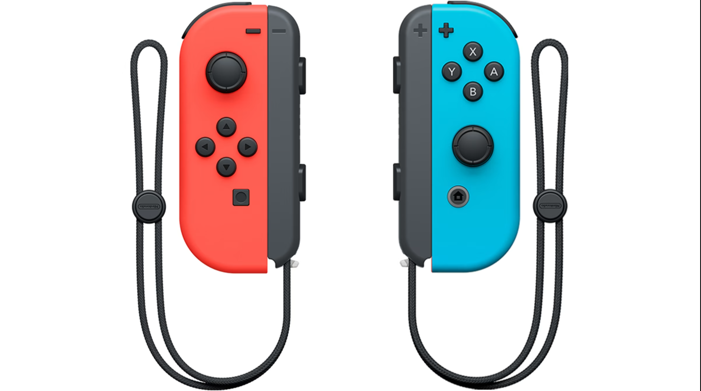
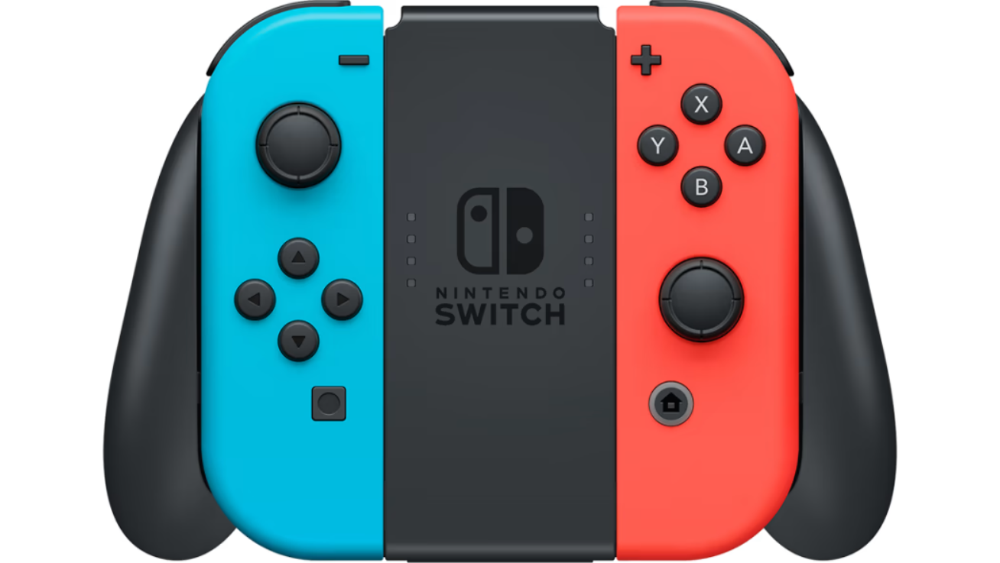

# UX Journal - j02
# Analysis of Nintendo Switch - User Perspective
## By Tamanna Haider - December 14th, 2022

**Strengths:** The Switch has a lot of moving parts involved with it. Just by looking at it, it seems like any other handheld gaming device. The buttons on the joy-cons, the controllers that slide onto the sides of the Switch to make it handheld, are the same buttons as seen on other controllers. The fact that the joy-cons slide onto the device to make it handheld, and can be slid off for multiplayer or mirrored screen is very **efficient**. This means the user can achieve maximum productivity, because in this case the user can choose which playing style they want to go with based on their needs. Typically, video game devices are either handheld or hooked up to a TV/monitor. There are analog sticks, the classic ABXY buttons, triggers, and bumpers. There are a few extra/different buttons on the controller from regular controllers. Even for people who haven't used gaming devices before, the device makes it clear *how* to control the screen. Each of the joy-cons can slide off and become it's own individual controller if turned sideways, or a pair of them can be used (one in each hand, so movement is not restricted). This is very clear from the wrist straps that are attached to the "cap" of each joy-con. Also, when the joy-cons are turned sideways, it resembles a normal controller, as opposed to all the extra buttons.

**Weaknesses:** There are quite a few extra buttons/different on the joy-cons when they're used together (either on the switch or off). Setting aside the classic control mechanisms (ABXY, analog sticks, bumpers, triggers, home button, menu button), there is an extra menu botton (minus symbol) on the left joy-con, even though there is already a menu button (plus symbol) on the right joy-con. Also, rather than having a D-pad on the left side, there is another set of four buttons, but instead of ABXY, it's four arrows, to imitate a D-pad. This is because each joy-con can be used as an individual controller, so even when split up, each player has the ability to access the menu. Another weakness is the screenshot button on the left joy-con. Although the left joy-con does not have the home button, it has a symmetrical button that screenshots whatever is on the screen. The placement of the minus button and screenshot button on the left joy-con make it difficult to use both joy-cons, as those are natural resting spots for finders, and it keeps getting in the way. This part of the design is not very **error tolerant**, or it's not resilient to human error. Additionally, when holding one joy-con horizontally, the bottom has no edge or lip to prevent it from slipping down. This makes it hard to keep your hands in a comfortable position, and ends up making you press the wrong buttons.

**Solutions:** Although Nintendo is going for an aesthetic look in which they try to make everything symmetrical between the joy-cons, it would probably do them some good to reconsider some of the buttons. For example, a screenshot can easily be a combination of buttons, like the bumper and A. The menu button could be shifted slightly, and overall it would be a much better experience for the user. The absence of a D-pad is not that detrimental though, as the same function can be achieved from the buttons, and it actually is easier to use buttons when the joy-con is being used individually. As for the "bottom" edge of an individual joy-con not having an edge to support your hands, it's probably because of the compatibility of the joy-cons, being able to slide onto the switch or onto a joy-con grip (special controller with empty slots for the joy-cons), but it would be nice if something was taken into consideration for this. Maybe the joy-con grip can be designed with a divet so the joy-cons can still slide in, even with an edge along the bottom.

